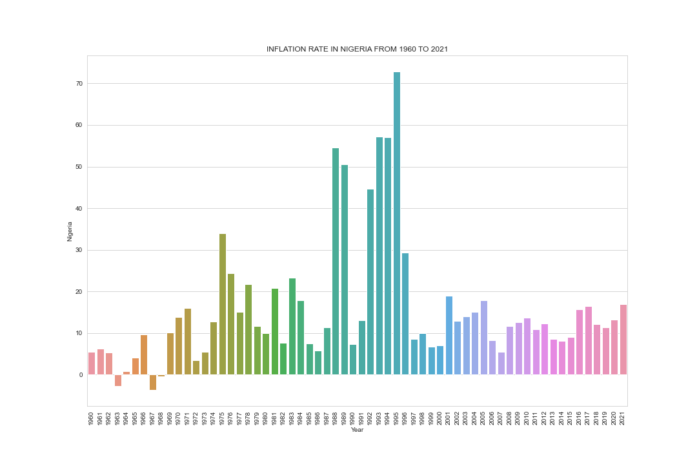
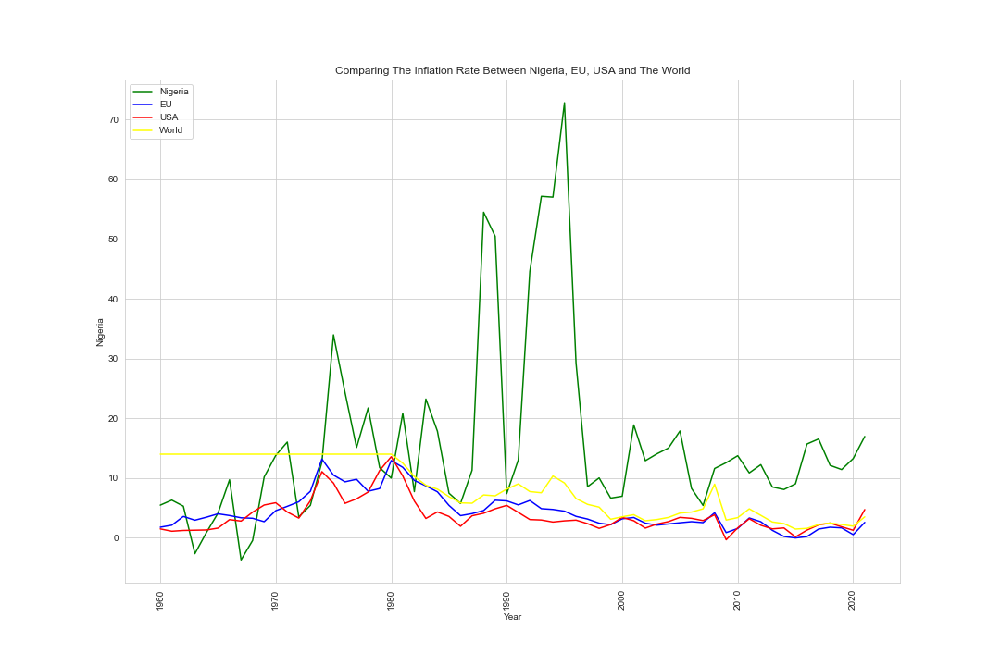

# Web Scrapping Nigeria Inflation Rate (1960-2021)

## Introduction
The major aim of this project is to webscrape Nigeria inflation data (since 1960 to 2021) from worlddata.info, then draw some insights like
- Year with highest inflation rate.
- Year with lowest inflation rate.
- The trend of the data.

## Tools
The tools used in this project includes python libraries like:
- BeautifulSoup - for scrapping HTML contents of a webpage.
- Requests - Request for approval for the data to be web scrapped, and get access to the webpage HTML contents.
- Pandas
- Numpy
- Seaborn
- Matplotlib

## Data Visualization

## Observation
These indicate that Nigeria has a higher inflation rate than other countries since 1990 to 2021. Also, Nigerian inflation trend has the highest irregular variation. 1995 is the highest year on record, saw a particularly high increase with 72% inflation rate. Although in 1963, 1967, and 1968 we had rates below 0 with -2.69%, -3.73%, and -0.48 respectively. Between 1960 and 179%, the global inflation rate remained constant at 2.19%. However, it increased to 13.98% in 1980, the highest recorded rate. Comparing these countries, the USA has the best control over inflation. However, they were also impacted by the 1980 inflation rate, which peaked at 13.55% but quickly declined to 3.21% in 1983.

## Conclusion
Web scraping makes it simple to retrieve large datasets from webpages.  Information can be extracted from a variety of websites using web scraping. 
From the data insights, Nigerian government need to formalate and implement policies to stable and relatively low inflation rate.

